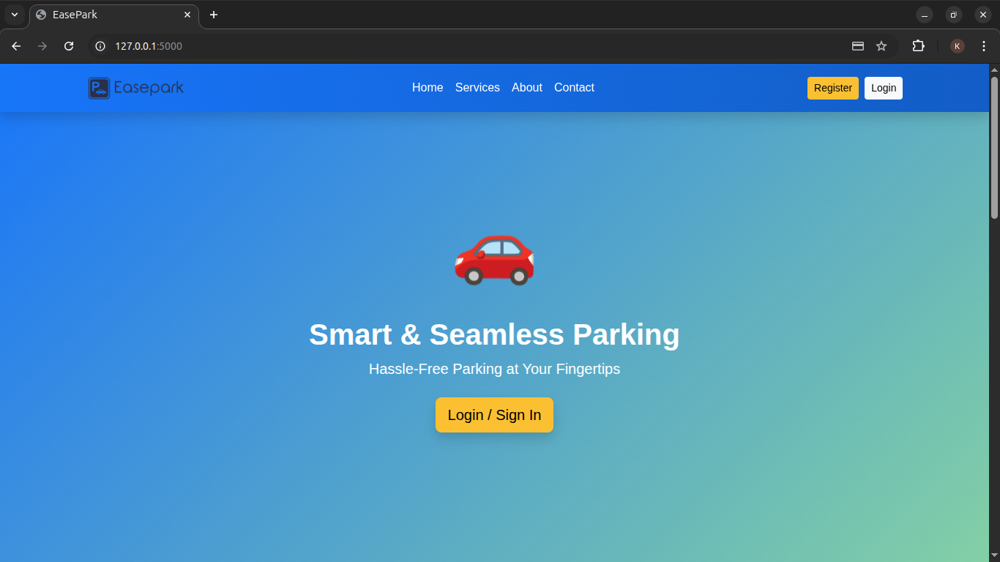
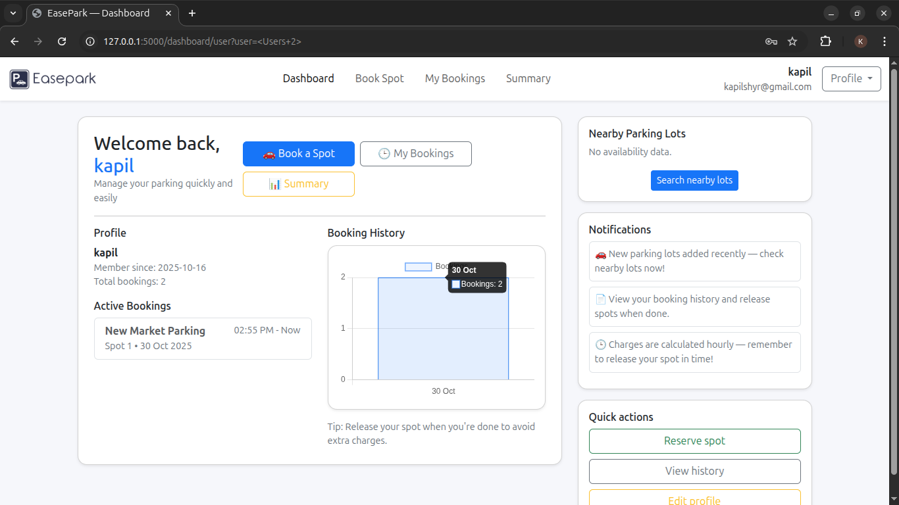
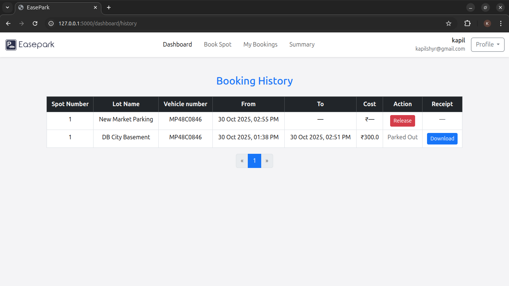
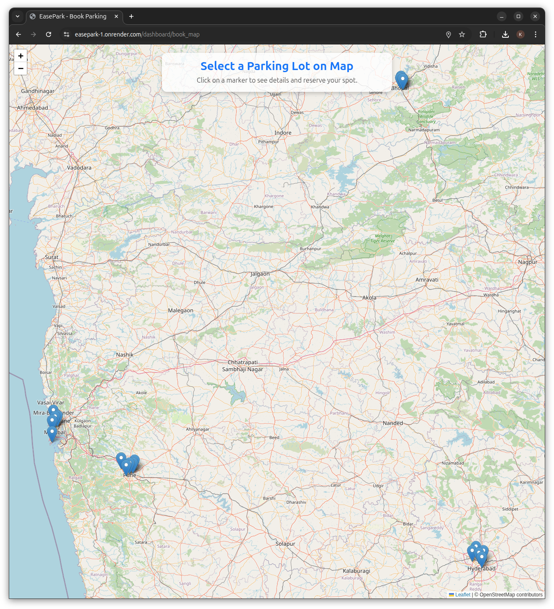
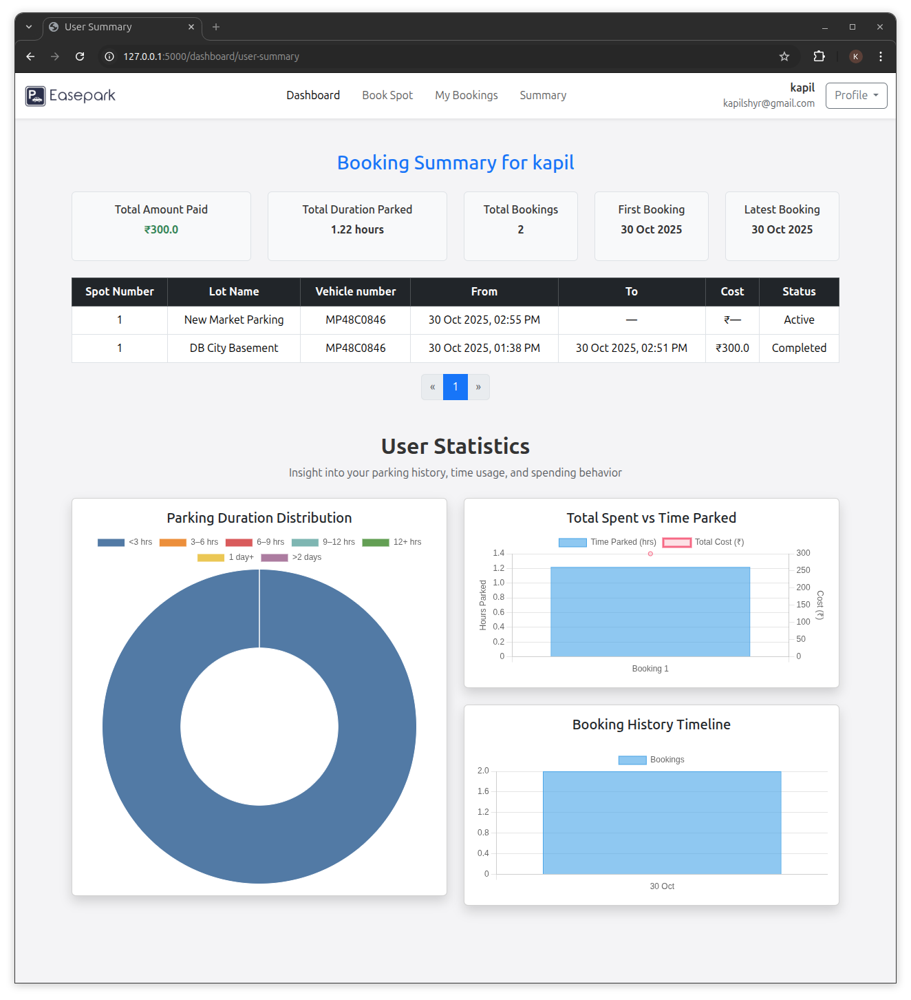
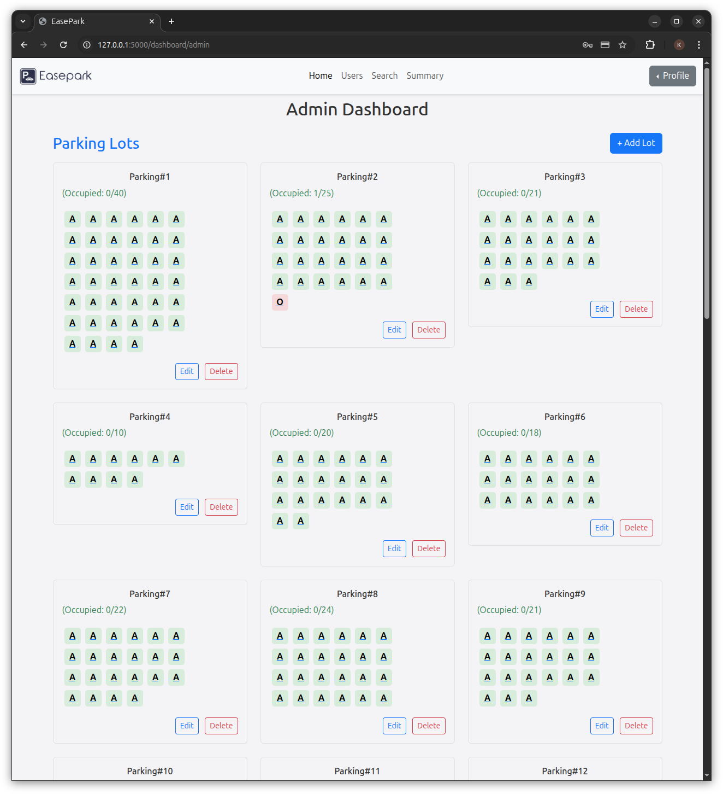

<table align="center">
  <tr>
    <td align="center" bgcolor="white" style="border-radius:10px;">
      
    </td>
  </tr>
</table>

<h1 align="center">EasePark 🚗 – Vehicle Parking Management System</h1>

<div align="center">


[](https://github.com/23f3002142/EasePark/actions/workflows/ci.yml)

</div>

---

EasePark is a **Flask-based Vehicle Parking Management System** designed to make parking smarter — from booking and payments to lot administration and data analytics.

🌐 **Live Demo:** [easepark-1.onrender.com](https://easepark-1.onrender.com)

---

## 📸 Gallery

| Home Page | User Dashboard |  Booking History |
|------------|----------------|-----------------|
|  |  |  |
| Booking via Map | User Statistics | Admin Lot Management |
|  |  |  |

---

## ✨ Features

### 👤 User Features
- 🔐 **Authentication:** Secure login via Email/Password or Google OAuth 2.0  
- 🗺️ **Interactive Map:** Real-time lot availability using Leaflet.js  
- ⏱️ **Live Booking:** Reserve and release parking in real time  
- 📩 **Email OTP Verification:** Integrated with Brevo SMTP  
- 💳 **Razorpay Payment Gateway:** Seamless digital payments  
- 📊 **User Dashboard:** Manage bookings, receipts, and personal stats  
- 📈 **Data Visualization:** Personal analytics using Chart.js  

### 🧑‍💼 Admin Features
- 🅿️ Manage multiple parking lots and their spots  
- 👥 Monitor user activities and bookings  
- 📉 Visual dashboard showing occupancy trends and revenue  
- ⚙️ Full CRUD control for lots, users, and pricing  

---

## 🛠 Tech Stack

| Category | Technologies |
|-----------|---------------|
| **Frontend** | HTML5, CSS3, JavaScript, Bootstrap 5, Leaflet.js, Chart.js |
| **Backend** | Python 3.11, Flask, Gunicorn |
| **Database** | PostgreSQL, Redis |
| **Authentication** | Google OAuth 2.0, Flask-Login |
| **Payments** | Razorpay API |
| **Email/Notifications** | Brevo (Sendinblue) SMTP |
| **Deployment** | Docker, Render |

---

## 🧩 System Architecture
```bash
[User] → [Browser] → [Render Host] → [Flask App] → [PostgreSQL]
│
├─> [Redis]
├─> [Razorpay API]
├─> [Brevo SMTP]
└─> [Google OAuth]
```

---

## 🚀 Getting Started (Local Setup)

The easiest way to run the entire stack (PostgreSQL, Redis, Flask Backend, and Vue Frontend) is using **Docker Compose**.

### 1️⃣ Run with Docker Compose (Recommended)

1. Make sure you have **Docker** and **Docker Compose** installed.
2. Create a `.env` file in the root directory (see configuration parameters below).
3. Run the following command to spin up the services:
   ```bash
   docker compose up --build
   ```
4. Access the application components:
   - **Frontend SPA App:** [http://localhost](http://localhost) (port 80)
   - **Backend API Docs (Swagger UI):** [http://localhost:5000/api/docs](http://localhost:5000/api/docs)
   - **Backend Health Check:** [http://localhost:5000/api/health](http://localhost:5000/api/health)

### 2️⃣ Manual Setup (Without Docker)

If you prefer to run the services individually:
- Setup a PostgreSQL database and a Redis instance locally.
- Backend:
  ```bash
  python -m venv venv
  source venv/bin/activate # or venv\Scripts\activate
  pip install -r requirements.txt
  flask db upgrade
  flask run
  ```
- Frontend:
  ```bash
  cd easepark-frontend
  npm install
  npm run dev
  ```

---

## ⚙️ Configuration (.env)
Create a `.env` file in the root directory with the following variables:
```env
SECRET_KEY=your_secret_key
SQLALCHEMY_DATABASE_URI=postgresql://easepark:easepark@db:5432/easepark
REDIS_URL=redis://redis:6379/0
GOOGLE_CLIENT_ID=your_google_client_id
GOOGLE_CLIENT_SECRET=your_google_client_secret
RAZORPAY_KEY_ID=your_razorpay_key_id
RAZORPAY_KEY_SECRET=your_razorpay_key_secret
MAIL_SERVER=smtp-relay.brevo.com
MAIL_PORT=587
MAIL_USERNAME=your_email@example.com
MAIL_PASSWORD=your_brevo_smtp_key
MAIL_DEFAULT_SENDER=your_email@example.com
```

---

## ⚙️ Test Accounts

| Role  | Email                                           | Password |
| ----- | ----------------------------------------------- | -------- |
| Admin | [admin@gmail.com](mailto:admin@easepark.com)    | admin123 |
| User  | [user@example.com](mailto:user@example.com)     | user123  |

---

## 💳 Razorpay Test Cards
| Type       | Card Number         | Exp   | CVV | Result    |
| ---------- | ------------------- | ----- | --- | --------- |
| Visa       | 4111 1111 1111 1111 | 12/29 | 123 | ✅ Success |
| Mastercard | 5123 4567 8901 2345 | 12/29 | 123 | ✅ Success |
| Visa       | 4111 1111 1111 1112 | 12/29 | 123 | ❌ Failure |

---

## 📦 Project Structure
```
EasePark/
├── app.py                  # Main Flask entrypoint & smorest config
├── requirements.txt        # Backend dependencies
├── Dockerfile              # Backend production Dockerfile
├── docker-compose.yaml     # Full local multi-container stack
├── .dockerignore           # Excludes local files from Docker builds
├── controllers/            # Blueprints (REST API layer)
│   ├── api_auth_routes.py
│   ├── api_user_routes.py
│   └── api_admin_routes.py
├── models/                 # SQLAlchemy Database models
│   └── user_model.py
├── schemas/                # Marshmallow validation/OpenAPI schemas
│   ├── auth_schemas.py
│   ├── lot_schemas.py
│   └── user_schemas.py
├── utils/                  # Utility modules (logging, email, etc.)
│   ├── logger.py           # Structured JSON logger
│   └── email.py
├── easepark-frontend/      # Vue 3 SPA frontend
│   ├── src/                # Vue sources
│   ├── Dockerfile          # Production multi-stage Nginx build
│   └── nginx.conf          # Nginx proxy & SPA router configuration
└── migrations/             # Alembic database migrations
```

---

## ☁ Deployment on Render

- Connect your GitHub repo to Render.
- Create a Web Service and select “Docker”.
- Add PostgreSQL and Redis services.
- Add all environment variables.
- Deploy — Render will automatically build and start your Flask app.

---

## 📄 License

This project is licensed under the MIT License.
See LICENSE for more details.

<p align="center"> Developed with ❤️ by <b>Kshitij Nigam</b> <br> <a href="https://github.com/23f3002142">GitHub</a> • <a href="https://linkedin.com/in/kshitij-nigam-281392287">LinkedIn</a> </p>